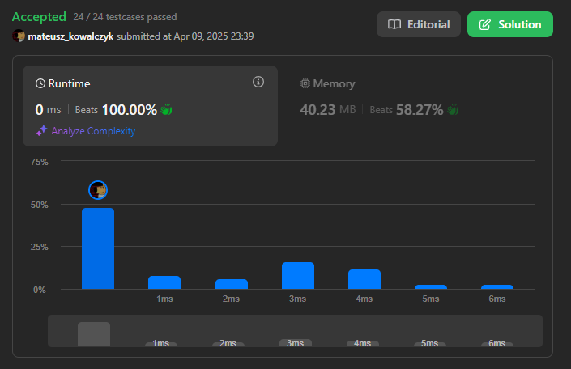

# 238. Product of Array Except Self [Medium]

Given an integer array `nums`, return **an array** `answer` such that `answer[i]` is equal to the **product of all the elements of** `nums` **except** `nums[i]`.

You must solve it **without using division** and in `O(n)` time.

---

## 🧪 Examples

### Example 1:
**Input:**  
`nums = [1, 2, 3, 4]`  
**Output:**  
`[24, 12, 8, 6]`  
**Explanation:**  
- answer[0] = 2 * 3 * 4 = 24  
- answer[1] = 1 * 3 * 4 = 12  
- answer[2] = 1 * 2 * 4 = 8  
- answer[3] = 1 * 2 * 3 = 6

---

### Example 2:
**Input:**  
`nums = [-1, 1, 0, -3, 3]`  
**Output:**  
`[0, 0, 9, 0, 0]`

---

## 📌 Constraints
- `2 <= nums.length <= 10^5`
- `-30 <= nums[i] <= 30`
- The product of any prefix or suffix of `nums` is guaranteed to fit in a **32-bit** integer.

---

## 🔗 Source  
[LeetCode Problem #238 – Product of Array Except Self](https://leetcode.com/problems/product-of-array-except-self/)

## Result

